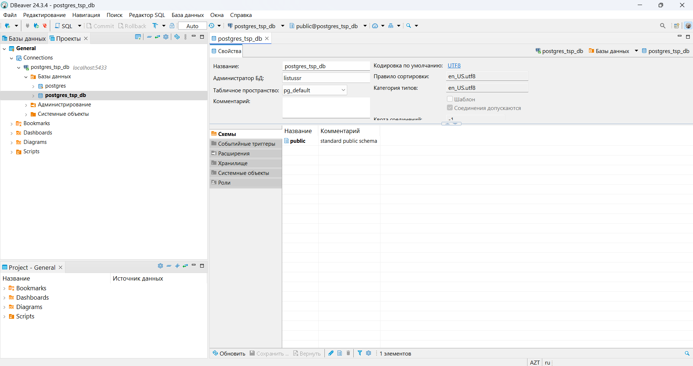

# Лабораторные работы по предмету "Технологии сетевого программирования"

### Тема проекта, реализуемого в рамках лабораторных работ:
### -> Сервис для распознавания эмоций людей по изображениям

# Лабораторная работа №0

## Концепция использования сервиса.

### 1. Данный сервис должен предоставлять возможность определять эмоции человека по изображению его лица.

### 2. Пользователь может выбрать нейронную сеть, которую он будет использовать для определения эмоций. Сервис предоставляет различные архитектуры сетей, обученные на разных датасетах.

### 3. В сервисе должна вестись запись история запросов к серверу. Т.е. пользователь может посмотреть запрос к серверу и ответ сети.

### Данный сервис предполагает последующее расширение в виде Android приложения и Telegram бота.

## Схема базы данных:


## [Схема API](api.yaml)

## Стек технологий:

### 1. PyTorch
### 2. Django
### 3. DjangoRestFramework
### 4. Docker

# Лабораторная 1

## Задача 1: Настройка базы данных
### 1. [Развёрнута база данных PostgreSQL через Docker](Dockerfile)
### 2.Выполнено подключение к базе через DBeaver 


## Задача 2: Разработка ORM-моделей:

### 1-2. [Определены сущности и связи между ними, реализованы модели с помощью Django ORM](src\fer_server\fer_database_app\models.py)

### 3. [Настроены миграции](src\fer_server\fer_database_app\migrations\0001_initial.py)

## Задача 3.

### 1. Определена структура модели пользователя;
 ```
 from django.contrib.auth.models import User

class UserModel(models.Model):
 
    user = models.OneToOneField(User, on_delete=models.CASCADE, related_name="user_model")

    users_id = models.DecimalField(max_digits=4, decimal_places=0, primary_key=True)

    interests = models.ManyToManyField(Interest, related_name="user_model", blank=True)

    class Meta:
        verbose_name = "User"
        verbose_name_plural = "Users"

    def __str__(self):
        return self.user.username

    @property
    def login(self):
        return self.user.username

    @property
    def email(self):
        return self.user.email
```

### 2. Настроено хеширование паролей.
```
PASSWORD_HASHERS = [
    'django.contrib.auth.hashers.PBKDF2PasswordHasher',
]
```

## Задача 4.
### 1. [Написаны скрипты для заполнения базы данных тестовыми данными](src\fer_server\Scripts_DB.py).

### База данных с тестовыми данными:


### 2. [Реализовал функционал для работы с данными в соответствии с тематикой выбранного приложения](Queryes.py)

# Лабораторная 2

## Задача №1.

### 1. [Реализовано API](src/fer_server/fer_database_app/views.py)

### 2. Настроены все маршруты:
```
urlpatterns = [
    path('admin/', admin.site.urls),
    path('models/', views.model_list, name='model-list'),
    path('models/<int:model_id>/', views.model_detail, name='model-detail'),
    path('datasets/', views.dataset_list, name='dataset-list'),
    path('datasets/<int:dataset_id>/', views.dataset_detail, name='dataset-detail'),
    path('trained-models/', views.trained_model_list, name='trained-model-list'),
    path('trained-models/<int:trained_model_id>/', views.trained_model_detail, name='trained-model-detail'),
    path('users/', views.user_list, name='user-list'),
    path('users/<int:user_id>/', views.user_detail, name='user-detail'),
    path('users/<str:login>/', views.user_login_detail, name='user-login-detail'),
    path('users-create/', views.create_user_and_user_model, name='user-create'),
    path('user-model/<int:user_id>/', views.update_user_model_trained_model, name='user-model-update'),
    path('history/<int:user_id>/', views.history_detail, name='history-detail'),
    path('predict/<int:user_id>/', views.predict, name='result'),
    path('image/<int:image_id>/', views.get_image, name='image'),
] + static(settings.MEDIA_URL, document_root=settings.MEDIA_ROOT)
```

## Задача №2.

### Выполнено тестирование через Postman:

#### Получение всех моделей: 

#### Получение модели по ID: 

#### Получение всех датасетов: 

#### Получение датасета по ID: 

#### Получение всех обученных моделей: 

#### Получение обученной модели по ID: 

#### Получение всех пользователей: 

#### Получение пользователя по ID: 

#### Получение пользователя по логину: 

#### Изменение обученной модели у пользователя: 

#### Добавление нового пользователя: 

#### Получение картинки по ID: 

#### Получение истории по ID пользователя 

#### Получение предсказания по изображению: 